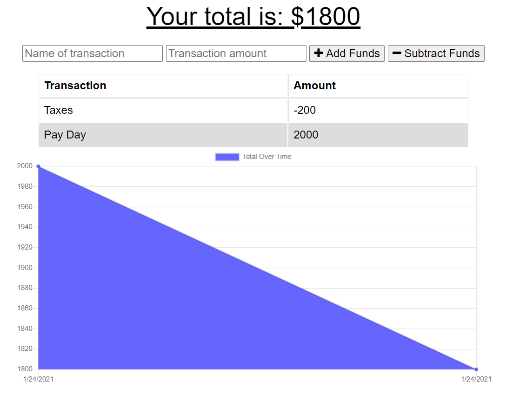

# Selma's HW18 Online Offline Budget Trackers

## Description:

In this activity we are building a budget tracker that can track deposits and withdrawals. The resulting information will then get passed into a graph for viewing over time. The benefit to this activity is that it can also run offline using Service Workers. When the network is unreachable, it then utilizes the native Index DB on the browser to cache the information logged offline. Once online again, it updates the backend in Mongo DB.

## A couple of things I learned in this:

- Service workers
- Cache
- Index DB
- How to connect Mongo DB to Heroku
- Web
- Non-sql databases

## Installation:

- If you need to pull my code for this homework, please visit my Github repository at: https://github.com/selma-e/Online_Offline_Budget_Trackers
- If you want to see the final webpage for my code, please visit my deployed website at: https://shielded-falls-12466.herokuapp.com/

## Usage:

## Resources Used/Credits:

- https://uwa.bootcampcontent.com/UWA-Bootcamp/uw-sea-fsf-pt-08-2020-u-c/-/blob/master/class-content/18-PWA/04-Important/MongoAtlas-Deploy.md
- https://uwa.bootcampcontent.com/UWA-Bootcamp/uw-sea-fsf-pt-08-2020-u-c/-/blob/master/class-content/17-NoSQL/04-Important/MongoAtlas-Setup.md

© 2021 Selma Elgabalawy | UW-SEA-FSF-PT-08-2020-U-C-TTh
